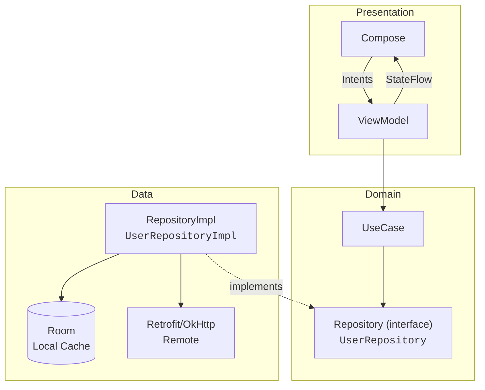

# Desafio Android — Solução (Jetpack Compose)

> **Resumo:** Arquitetura modular, UDF com ViewModel + StateFlow, offline-first (Room), testes (unit + instrumentado + UI Compose) 


---

## Como rodar 

```bash
# 1) Clonar
git clone https://github.com/sabinabernardes/Desafio1.git
cd Desafio

# 2) Build rápido
./gradlew clean assembleDebug

# 3) Testes unitários
./gradlew test
# (opcional) ./gradlew connectedCheck  # se tiver device/emulador

# 4) Abrir no Android Studio e rodar
```

---

## Índice
1. [Stack](#stack)
2. [Screenshots / GIFs](#screenshots--gifs)
3. [Arquitetura](#arquitetura)
4. [Módulos](#módulos)
5. [Fluxo de Dados](#fluxo-de-dados)
6. [Política de Cache](#política-de-cache)
7. [Como Testar](#como-testar)
8. [Testes](#testes)
9. [Casos de Uso](#-casos-de-uso)
10. [Trade-offs e Decisões Técnicas](#trade-offs-e-decisões-técnicas)
11. [Coisas Legais Pra Ver](#coisas-legais-pra-ver-por-aqui)
12. [Próximos Passos](#próximos-passos)

---

## Stack
| Camada | Libs |
| ------ | ---- |
| UI | **Jetpack Compose**, Navigation Compose, Coil |
| DI | Koin |
| Assíncrono | Coroutines + Flow |
| Network | Retrofit |
| Cache | Room |
| Testes | JUnit5, MockK, Turbine, Compose Testing |

---

## Screenshots / GIFs

https://github.com/user-attachments/assets/81590e8a-b5d5-4394-b509-5399b52f3954


---

## Arquitetura



> **Por que assim?**   
> - Evolução sem quebra: UI, Domain e Data desacoplados.  
> - Offline-first: Repository decide entre Room e API.

---

## Módulos

- [`app/`](app) — DI + Navegação  
- [`core/designsystem/`](core/designsystem) — Tema, cores, componentes  
- [`core/navigation`](core/navigation) — Composition root e navegação  
- [`feature/home/`](feature/home) — Tela principal (UI + VM + DI)  

---

## Fluxo de Dados

```kotlin
sealed class HomeUiState {
    object Loading : HomeUiState()
    data class Success(val users: List<UserUi>) : HomeUiState()
    object Empty : HomeUiState()
    data class Error(val message: String) : HomeUiState()
}
```

---

## Política de Cache

1. Room primeiro (`loadFromDb()`)  
2. Se dados velhos, refresh em paralelo (API → Room → UI)  

---
### Como testar
1. Rodar o app e ver a lista (estado Loading → Success).  
2. Ativar **modo avião** e reabrir o app: lista continua disponível (cache local).  
3. Desativar modo avião: dados são atualizados quando a rede volta.

---

## Testes

| Tipo | Ferramentas | Casos principais |
| ---- | ----------- | ---------------- |
| Unit | JUnit, MockK, Turbine | VM emite Loading→Success; Repo acessa cache e API |
| Instrumentado | Room in-memory |
| UI Compose | Compose Test | Estados loading/error/success e ações |

---

## 📱 Casos de Uso

Mapeamento dos cenários principais implementados:

| UC | Cenário | Status | Como Testar                                 |
|----|---------|--------|---------------------------------------------|
| UC-001 | Primeira Instalação + Shimmer | ✅ | Abrir app pela primeira vez                 |
| UC-002 | App com Cache Local | ✅ | Rodar app, modo avião, reabrir              |
| UC-003 | Erro sem Cache + Retry | ✅ | Desconectar rede, clicar "Tentar Novamente" |
| UC-004 | Pull to Refresh | ✅ | click na tela                               |
| UC-005 | Lista Vazia | ✅ | Simular resposta vazia da API               |

---

##  Trade-offs e Decisões Técnicas

Aqui estão as principais escolhas de arquitetura e por que elas foram feitas neste projeto.  
A ideia não é só listar tecnologias, mas mostrar **o raciocínio** por trás delas.

### **UI e Arquitetura**
- **Jetpack Compose** → Mais rápido pra iterar e testar.  
  _Trade-off_: curva de aprendizado e atenção à recomposição; resolvido com UDF + estados imutáveis.
- **Unidirectional Data Flow (UDF)** com `StateFlow` → Estado único, previsível e fácil de testar.
  - Inclui `distinctUntilChanged()` para evitar duplicatas
- **Kotlin Flow** no domínio/repos** → Fluxos reativos pra dados contínuos (ex.: Room emite mudanças automaticamente).  
  _Benefício_: evita callbacks e facilita composição de operações assíncronas.  
  _Trade-off_: exige atenção a escopo/cancelamento; mitigado com `viewModelScope` e operadores como `onStart`/`catch`.
- **ViewModel + UseCases** → Isolamento de regras de negócio da UI.  
  _Custo_: mais arquivos, ganho em clareza e escalabilidade.

### **Injeção de Dependências**
- **Koin** → Setup rápido e simples.  

### **Estratégia de Dados**
- **Offline-first com Room** → Resposta instantânea do cache local, seguido de atualização em segundo plano (*stale-while-revalidate*).
- **ErrorMapper** → Mapeamento robusto de exceções para tipos específicos (Network, Unauthorized, NotFound, Unknown) com mensagens amigáveis ao usuário.

### **Testes e Qualidade**
- **Testes de ViewModel**  (validação de fluxo de estados).
- **CI** com build, lint, testes.
- **ktlintCheck** e **Detekt** para manter o padrão de código.

---

## 🎯 Coisas Legais Pra Ver Por Aqui

Aqui estão os 11 highlights técnicos.

### 🏗️ Padrões & Arquitetura

#### 1. **Sealed Class Pattern para Estados** ⭐⭐⭐
- **Arquivo**: [HomeUiState.kt](feature/home/src/main/java/com/bina/home/presentation/viewmodel/HomeUiState.kt)
- **O que**: Estados mutuamente exclusivos (Loading, Success, Error)
- **Por quê**: Type-safe, impossível ter estado inválido
- **Ganho**: `when (uiState)` força cobertura de TODOS os casos

#### 2. **Separação de Responsabilidades em Composables** ⭐⭐⭐
- **Arquivo**: [HomeScreen.kt](feature/home/src/main/java/com/bina/home/presentation/screen/HomeScreen.kt)
- **Estrutura**:
  - `HomeRoute()` → DI (Koin)
  - `HomeScreen()` → Coleta estado do ViewModel
  - `HomeScreenContent()` → Lógica pura
  - `LoadingSection()`, `ErrorSection()`, `UsersSection()` → Especializadas
- **Ganho**: Fácil testar, reutilizar, mockar

#### 3. **StateFlow + Coroutines + Catch** ⭐⭐⭐
- **Arquivo**: [HomeViewModel.kt](feature/home/src/main/java/com/bina/home/presentation/viewmodel/HomeViewModel.kt)
- **Padrão**: `observeUseCase().map().catch().stateIn()`
- **Ganho**: Tratamento de erro centralizado, sem callbacks

### 🎨 UI/UX Padrões

#### 4. **Pull-to-Refresh com Acessibilidade** ⭐⭐
- **Destaque**: `PullRefreshIndicator` com `semantics { contentDescription }`
- **Dinamismo**: Descrição muda (loading vs idle)
- **A11y**: TalkBack funciona perfeitamente

#### 5. **Estados Vazios vs Erros (UX Crítica)** ⭐⭐
- **Diferença**:
  - **Vazio** = Sucesso sem dados → "Atualizar Agora"
  - **Erro** = Falha real → "Tentar Novamente"
- **Ganho**: Usuário entende o que aconteceu

#### 6. **Shimmer Loading Profissional** ⭐⭐
- **Componente**: `ShimmerUserListLoading()` (Design System)
- **Quando**: Durante LoadingSection
- **Por quê**: Feedback visual mantém engajamento

#### 7. **Retry com Estados de Desabilitar** ⭐⭐
- **Detalhe**: Botão desabilita durante retry + loading spinner
- **Ganho**: Evita múltiplos cliques, feedback visual claro

### ⚡ Performance & Otimizações

#### 8. **LazyColumn com Key para Recomposição Eficiente** ⭐⭐
- **Código**: `items(items = users, key = { it.id })`
- **Por quê**: Cada item tem ID, recompõe só os novos
- **Impacto**: Performance em listas 1000+ items

#### 9. **Design System com Tokens Centralizados** ⭐⭐
- **Uso**: `Dimens.spacing16`, `Typography.displayLarge`, `ColorPrimary`
- **Ganho**: Trocar tema = mudar 1 arquivo
- **Coerência**: Toda UI segue mesma escala

#### 10. **collectAsState() para Recomposição Fina** ⭐⭐
- **Código**: Cada `by viewModel.state.collectAsState()`
- **Ganho**: Recompõe só quando estado muda (não toda frame)

### 🧪 Testabilidade

#### 11. **Composables Puros (100% Testáveis)** ⭐⭐⭐
- **Função**: `HomeScreenContent()` é pura
- **Sem**: Koin, ViewModel, Context
- **Resultado**: Fácil testar com Compose Testing Library


## 👤 Autor

**Sabina Ricardo** — [GitHub](https://github.com/sabinabernardes)

## 📝 Licença

MIT License

---

## 🚀 Próximos Passos

### 🔄 Curto Prazo 
- [ ] Implementar testes E2E com UI Automator
- [ ] GitHub Actions CI/CD com relatórios de cobertura

### 📈 Médio Prazo
- [ ] Feature flags para rollout gradual
- [ ] Performance profiling e otimização
- [ ] Deep linking e navegação avançada

### 🚀 Longo Prazo
- [ ] Analytics e crash reporting (Firebase)
- [ ] Documentação de API com Swagger
- [ ] Suporte a múltiplas localidades (i18n)

