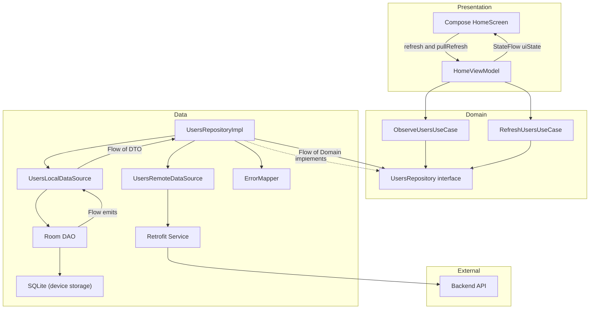

# Desafio Android — Solução (Jetpack Compose)

> **Resumo:** Arquitetura modular, UDF com ViewModel + StateFlow, offline-first (Room), testes (unit + instrumentado + UI Compose) 


---

## Como Clonar 

```bash
# 1) Clonar
git clone https://github.com/sabinabernardes/Desafio1.git
cd Desafio1

```

---

## Índice
1. [Stack](#stack)
2. [Screenshots / GIFs](#screenshots--gifs)
3. [Arquitetura](#arquitetura)
4. [Módulos](#módulos)
5. [Fluxo de Dados](#fluxo-de-dados)
6. [Política de Cache](#política-de-cache)
7. [Como Testar](#como-testar)
8. [Testes](#testes)
9. [Casos de Uso e testes reais](#-casos-de-uso)
10. [Trade-offs e Decisões Técnicas](#trade-offs-e-decisões-técnicas)
12. [Próximos Passos](#próximos-passos)

---

## Stack
| Camada | Libs |
| ------ | ---- |
| UI | **Jetpack Compose**, Navigation Compose, Coil |
| DI | Koin |
| Assíncrono | Coroutines + Flow |
| Network | Retrofit |
| Cache | Room |
| Testes | JUnit5, MockK, Turbine, Compose Testing |

---

## Screenshots / GIFs

https://github.com/user-attachments/assets/81590e8a-b5d5-4394-b509-5399b52f3954


---

## Arquitetura



> **Por que assim?**   
> - UDF + MVVM: Compose é stateless, ViewModel expõe StateFlow e recebe eventos (ex.: refresh).  
> - Domain manda na regra: UseCases coordenam o fluxo sem depender de Retrofit/Room.
> - Data é plugável: Repository implementa interface e encapsula cache + rede, mantendo o app responsivo e resiliente.

---

## Módulos

- [`app/`](app) — DI + Navegação  
- [`core/designsystem/`](core/designsystem) — Tema, cores, componentes  
- [`core/navigation`](core/navigation) — Composition root e navegação  
- [`feature/home/`](feature/home) — Tela principal (UI + VM + DI)  

---

## Fluxo de Dados

```kotlin
sealed class HomeUiState {
    object Loading : HomeUiState()
    data class Success(val users: List<UserUi>) : HomeUiState()
    object Empty : HomeUiState()
    data class Error(val message: String) : HomeUiState()
}
```

---

## Política de Cache

1. Room primeiro (`loadFromDb()`)  
2. Se dados velhos, refresh em paralelo (API → Room → UI)  

---

## Testes

| Tipo | Ferramentas | Casos principais |
| ---- | ----------- | ---------------- |
| Unit | JUnit, MockK, Turbine | VM emite Loading→Success; Repo acessa cache e API |
| UI Compose | Compose Test | Estados loading/error/success e ações |

---

## 📱 Casos de Uso e Teste Reais 

Mapeamento dos cenários principais implementados:

| UC | Cenário | Status | Como Testar |
|----|---------|--------|-------------|
| UC-001 | Primeira Instalação + Shimmer | ✅ | Abrir app pela primeira vez |
| UC-002 | App com Cache Local | ✅ | Rodar app, modo avião, reabrir |
| UC-003 | Erro sem Cache + Retry | ✅ | Desconectar rede, clicar "Tentar Novamente" |
| UC-004 | Pull to Refresh | ✅ | Deslizar para cima na tela |
| UC-005 | Lista Vazia | ✅ | Simular resposta vazia da API |

### 📹 Evidências em Vídeo

**UC-001 — Primeira Instalação + Shimmer**
<video src="https://github.com/user-attachments/assets/7005ad26-09e8-4650-9caa-65360abfa3db" width="320" height="640" controls></video>

**UC-002 — App com Cache Local**
<video src="https://github.com/user-attachments/assets/14dd3b99-37f4-4bcc-9a57-3bfc52272a55" width="320" height="640" controls></video>

**UC-003 — Erro sem Cache + Retry**
<video src="https://github.com/user-attachments/assets/f0036108-ee57-4309-83fd-ecc296d87483" width="320" height="640" controls></video>

---

## Trade-offs e Decisões Técnicas

Aqui estão as decisões principais e o porquê delas. A ideia é mostrar o raciocínio (não só listar libs).

### UI e Arquitetura
- **Jetpack Compose** → Iteração rápida, UI declarativa e testes de UI mais diretos.  
  _Trade-off_: recomposição exige cuidado; mitigado com **UDF**, estado imutável e componentes pequenos.
- **UDF com `StateFlow`** → A tela renderiza a partir de um `UiState` único (Loading/Empty/Success/Error) e dispara eventos (`refresh`).  
  _Benefício_: previsibilidade e testes simples (Turbine).
- **Flows reativos (Room → UI)** → A fonte de verdade é o **cache local**. Quando o Room muda, a UI atualiza automaticamente.  
  _Trade-off_: pode emitir estados repetidos; mitigado com `distinctUntilChanged()` e modelagem de estado na ViewModel.
- **ViewModel + UseCases** → UI não conhece DataSources/Retrofit/Room.  
  _Custo_: mais classes/arquivos; _ganho_: separação clara, facilidade de mock e evolução sem acoplamento.

### Injeção de Dependências
- **Koin** → Setup rápido e legível para um desafio, com DI por módulo (feature/home).  
  _Trade-off_: menos “compile-time safety” que Dagger/Hilt, mas atende bem ao escopo e mantém o projeto leve.

### Estratégia de Dados
- **Offline-first (Room como fonte)** → Primeiro renderiza do cache (se existir) e depois sincroniza em background (API → Room).  
  _Benefício_: melhora tempo de primeira renderização e resiliente a falha de rede.
- **Refresh one-shot** (`take(1)` no remoto) → Evita `collect` infinito em `refreshUsers()` e torna o refresh determinístico.
- **ErrorMapper** → Converte exceções (rede/HTTP/desconhecido) em tipos (`UserError`) e mensagens amigáveis.  
  _Decisão_: em falha de rede, mantém a experiência **sem derrubar a lista** (offline-first) e apenas registra/loga o problema.

### Testes e Qualidade
- **ViewModel tests (Turbine)** → Valida o fluxo de estados (`Loading → Empty/Success/Error`) e o controle de `isRefreshing`.
- **Repository tests** → Garante que `refreshUsers()` insere no local quando o remoto responde e que falhas são tratadas (ex.: rede não derruba).
- **DataSource tests** → Verifica mapeamentos Entity ↔ DTO e chamadas corretas no DAO.
- **Qualidade** → Detekt/Ktlint para consistência e CI rodando build + testes.

---


## 👤 Autor

**Sabina Ricardo** — [GitHub](https://github.com/sabinabernardes)

## 📝 Licença

MIT License

---

## 🚀 Próximos Passos

### 🔄 Curto Prazo 
- [ ] Implementar testes E2E com UI Automator
- [ ] GitHub Actions CI/CD com relatórios de cobertura

### 📈 Médio Prazo
- [ ] Feature flags para rollout gradual
- [ ] Performance profiling e otimização
- [ ] Deep linking e navegação avançada

### 🚀 Longo Prazo
- [ ] Analytics e crash reporting (Firebase)
- [ ] Documentação de API com Swagger
- [ ] Suporte a múltiplas localidades (i18n)

